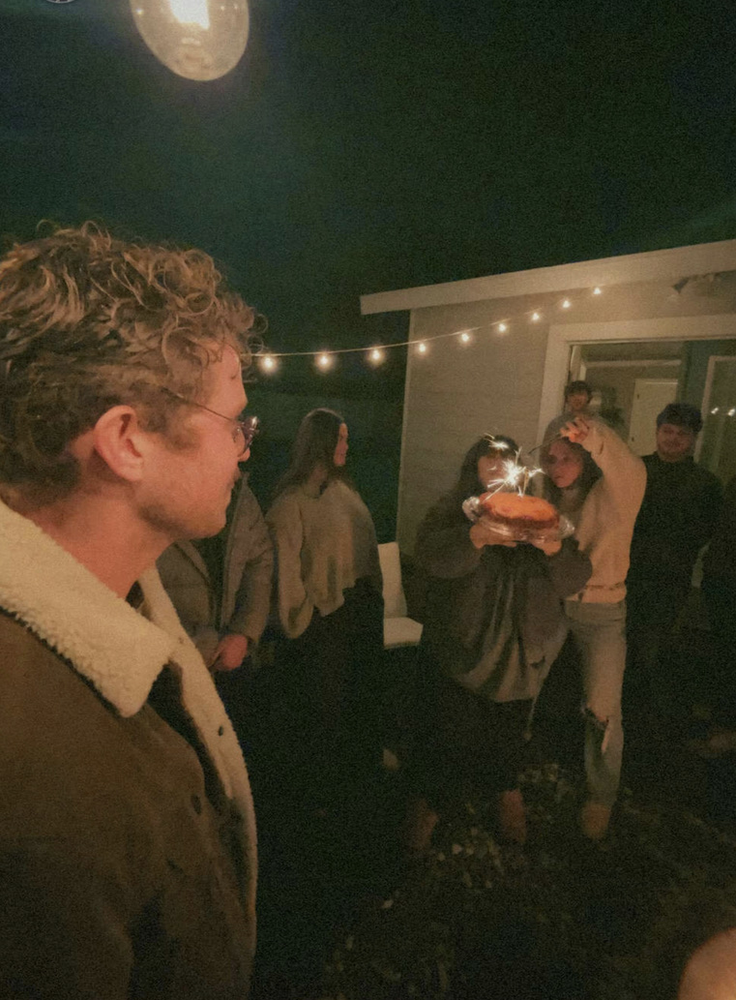

# IDS2024S

**IDS2024S, Introduction to Data Science, Sring 2024**  
**Name:** Harold Otey    
**School ID: <1001740735>**   
**Email**: <Hmo0735@mavs.uta.edu>  
**Department**: Communication    
**University**: The University of Texas at Arlington   
**Level**: <undergraduate or graduate> - Senior (4th year)  
**Position Title**: Student  
**Course Webpage**: [IDS2024S](https://www.cdslab.org/IDS2024S/)     
**Photo**:  
       

This repository contains my homework, quizzes, and virtually every effort that I have made for Data-1301. The structure of the project is the following:

+ [homework](./hw): This directory contains all my homework submissions, each of which is a folder properly named with homework number, containing the homework submission.  

+ [quiz](./quiz): This directory contains all my quiz submissions, each of which is a folder properly named with quiz number, containing the quiz submission.  

+ [exam](./Exams): This directory contains all my exam submissions, each of which is a folder properly named with exam name or number, containing the exam submission.  

  

